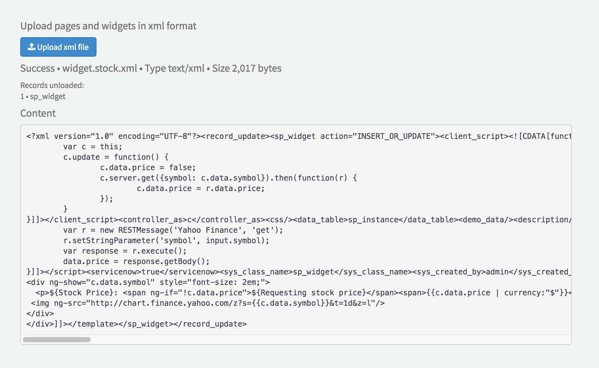

# x-loader Widget
An easy way to import pages and widgets into Service Portal.

##Preview

## Installation

1. Go to [`x-loader.xml`](src/x-loader.xml?raw=true) and right click, Save As...
2. Go to your instance and import the downloaded xml file
3. View the widget by navigating to yourinstance/$sp.do?id=x-loader

